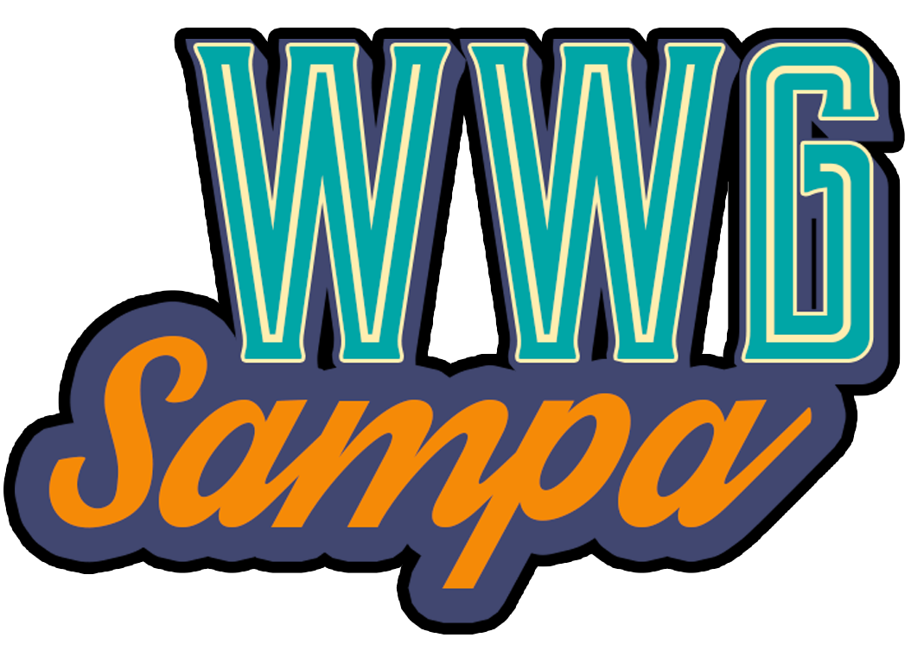

<h1 align="center">Vagas</h1>

:gopherparty: Espaço para divulgação de vagas para desenvolvedoras Golang.

# Vagas (Somente vagas de Golang para mulheres e minorias)

Espaço para a divulgação de vagas para pessoas desenvolvedoras pertecentes a grupos de minorias via _issues_ do Github. O objetivo aqui é tornar a área de tecnologia mais diversa, e para isso acreditamos que temos a missão de ativamente buscar essas desenvolvedoras*.

Vagas disponíveis em https://github.com/wwgsampa/vagas/issues

* Para uma linguagem de gênero neutra e inclusiva estamos nos referindo a sociedade como _pessoas_. Para exemplificar: as (pessoas) candidatas, as (pessoas) desenvolvedoras. 

### Cadastrando uma vaga

1. Abra uma **issue** e, no titulo desta _issue_, coloque o nome da cidade entre colchetes seguido do nome da vaga e nome da empresa.

Exemplo: `[São Paulo] Desenvolvedora Golang na [NOME DA EMPRESA]`

2. Informe quais _labels_ devemos adicionar, contendo o nível de experiência desejada e a forma de contração.

**Atenção**: 
* Não aceitaremos vagas sem o nome da empresa contratante.

#### Importante

1. Para evitar que possíveis candidatas enviem cvs para vagas já preenchidas, dê manutenção à sua issue, a cada 3 meses, coloque um comentário que continua procurando para a vaga ou feche a mesma comentando se a pessoa foi contratada através do nosso grupo ou por fora. Caso a issue passe de 3 meses e não tiver manutenção, a mesma poderá ser fechada por uma moderadora do repositório.

2. Se a vaga está pendente de informação e/ou fora do padrão especificado no [modelo da issue](https://github.com/wwgsampa/vagas/blob/master/.github/ISSUE_TEMPLATE/adicionar-nova-vaga.md), uma das moderadoras ou administradoras poderá fechar a issue. Ela pode ser reaberta a qualquer momento, desde que tenha sido devidamente preenchida.

### Como receber atualizações de novas vagas:
Você pode receber atualizações das vagas no seu email ou via notificações do Github, basta clicar em **Watch** e, em seguida, clicar em **Watching**, você pode modificar o modo de receber notificações em **[notifications](https://github.com/settings/notifications)** no próprio Github.

### Outros repositórios de vagas

Como esse repositório é específico para a postagem de vagas de **GO**,
mas existem vagas para muitas outras áreas nesse mercado, mas existem outras listas específicas para diferentes _stacks_ e estados do país. 
Confira abaixo as outras listas onde você poderá postar/ encontrar sua vaga:

#### Por área

- [Vagas Back-End](https://github.com/backend-br/vagas)
- [Vagas Front-End](https://github.com/frontendbr/vagas)
- [Vagas para UI/UX](https://github.com/uxbrasil/vagas)
- [Vagas para QAs](https://github.com/qa-brasil/vagas)

#### Por tecnologia

- [Vagas Android](https://github.com/androiddevbr/vagas)
- [Vagas iOS e OSX](https://github.com/CocoaHeadsBrasil/vagas)
- [Vagas PHP](https://github.com/phpdevbr/vagas)
- [Vagas Python](https://pyjobs.com.br)
- [Vagas Vue.js](https://github.com/vuejs-br/vagas)
- [Vagas Go/Golang](https://github.com/Gommunity/vagas)
- [Vagas Flutter](https://github.com/flutter-brazil/vagas)
- [Vagas React/React Native](https://github.com/react-brasil/vagas)
- [Vagas .NET](https://github.com/dotnetdevbr/vagas)
- [Vagas Rust](https://github.com/rustdevbr/vagas)
- [Vagas Elm](https://github.com/FidelisClayton/elm-jobs)

## Licença

[MIT](/LICENSE) &copy; WWG Sampa

